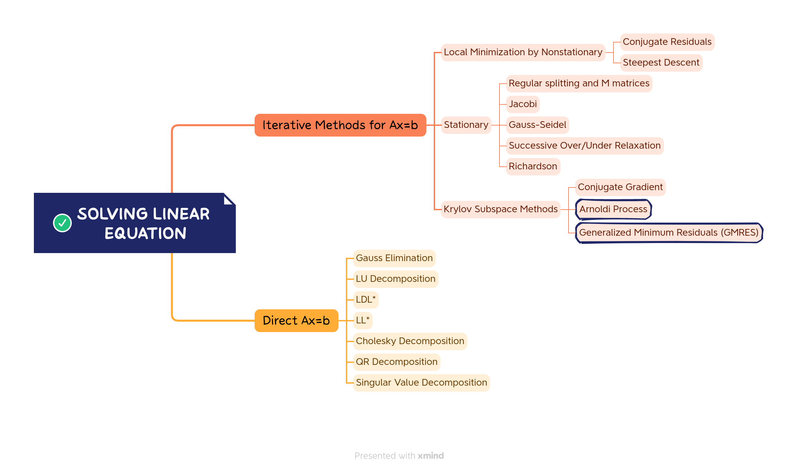

# Scientific Computing Tutorials

This repository contains a collection of notebook tutorials showcasing various scientific computing methods. Each tutorial focuses on a specific topic and provides detailed explanations, code examples, and demonstrations. Whether you are a beginner or an experienced practitioner in the field of scientific computing, these tutorials will help you explore and enhance your understanding of different computational techniques.

Additionally, the repository includes a comprehensive taxonomy mindmap that serves as a visual guide to navigate the various concepts and subtopics covered in the tutorials. The mindmap offers an organized overview of the different scientific computing methods, making it easier to locate specific topics of interest and establish connections between related concepts.

Whether you are looking to learn new computational techniques, refresh your knowledge, or explore advanced scientific computing methodologies, this repository and its accompanying mindmap will serve as valuable resources to accelerate your learning journey. Join us in mastering the world of scientific computing!